<div align="center">
  
</div>

---

Practical field guide for getting started as a SOC Level 1 analyst. Covers foundational knowledge, essential tools, hands-on practice platforms, and career progression.

Aimed at people new to defensive security — IT professionals pivoting to security, students, and self-learners who want a direct path into SOC work without the noise.

---

## Contents

- [How to Use This Guide](#how-to-use-this-guide)
- [Learning Approach](#learning-approach)
- [Core Knowledge](#core-knowledge)
- [SOC Tools](#soc-tools)
- [Quick Reference](#quick-reference)
- [Practice Platforms](#practice-platforms)
- [Home Lab](#home-lab)
- [Staying Current](#staying-current)
- [Career Path](#career-path)
- [Contributing](#contributing)

---

## How to Use This Guide

There's a lot here. Don't try to absorb it all at once.

Follow the suggested order if you're new to networking and operating systems — the fundamentals section exists for a reason. Once you have a foundation, go deeper on whatever your role or interests demand.

Theory and practice go together. Reading alone won't build skills. Use the labs.

Fork this repo and annotate it as you go. Mark what you've done, what you want to revisit, and add your own notes.

---

## Learning Approach

**Active over passive.** Summarize what you read, explain it back to yourself, practice in labs. Passive consumption doesn't build skills.

**Deliberate practice.** Focus on specific gaps. Don't repeat what you're already comfortable with.

**Spaced repetition.** For definitions and concepts that need to stick, [Anki](https://apps.ankiweb.net/) works. Use it.

**Document everything.** Keep notes on commands, workflows, errors, and fixes. [Obsidian](https://obsidian.md/), [Joplin](https://joplinapp.org/), or plain text all work. The format doesn't matter — the habit does.

**Traps to avoid:**

- Spending too long choosing a learning path instead of starting one
- Watching tutorials without doing any labs ("tutorial hell")
- Skipping networking and OS fundamentals — they surface constantly in real work
- Unsustainable pace leading to burnout — consistency beats intensity every time

---

## Core Knowledge

### Networking

Understanding how devices communicate is the baseline for spotting anomalies.

Topics to cover: OSI and TCP/IP models, IPv4/v6 and subnetting basics, common ports and protocols (HTTP/S, DNS, DHCP, ICMP, SSH, RDP), MAC addresses, switches vs. routers.

Resources:
- [Professor Messer — Network+ (N10-008)](https://www.professormesser.com/network-plus/n10-008/n10-008-training-course/) — free, clear, complete
- [TryHackMe — Network Fundamentals Path](https://tryhackme.com/path/outline/networkfundamentals) — interactive labs
- [Practical Networking](https://www.practicalnetworking.net/) — clean explanations with diagrams
- [Cloudflare Learning Center](https://www.cloudflare.com/learning/dns/what-is-dns/) — short articles on DNS, TCP/IP

> Capture traffic on your home network with Wireshark. Understanding what normal looks like is the first step toward spotting what isn't.

---

### Operating Systems

You'll be working with Windows and Linux logs constantly. Both matter.

**Linux:** directory structure, core commands (`ls`, `cd`, `cat`, `grep`, `find`, `ps`, `awk`, `sed`), permissions and users, log locations (`/var/log/`).

**Windows:** directory structure, CMD/PowerShell basics (`ipconfig`, `netstat`, `tasklist`, `Get-WinEvent`), Event Viewer channels and common event IDs (4624, 4625, 4688, 4698, 4720), Registry structure, Task Manager and Resource Monitor.

Resources:
- [TryHackMe — Linux Fundamentals Path](https://tryhackme.com/path/outline/linuxfundamentals)
- [TryHackMe — Windows Fundamentals Path](https://tryhackme.com/path/outline/windowsfundamentals)
- [Linux Journey](https://linuxjourney.com/) — text lessons with exercises, free
- [OverTheWire — Bandit](https://overthewire.org/wargames/bandit/) — learn Linux commands through a wargame
- [Ultimate Windows Security — Event ID Encyclopedia](https://www.ultimatewindowssecurity.com/securitylog/encyclopedia/)

> Prioritize the command line in both systems. Most analysis workflows depend on it.

---

### Security Fundamentals

Topics to cover: CIA triad, AAA model, defense in depth, Cyber Kill Chain, MITRE ATT&CK (introduction), common threat types (malware, phishing, ransomware, DDoS).

Resources:
- [Professor Messer — Security+ (SY0-601)](https://www.professormesser.com/security-plus/sy0-601/sy0-601-training-course/) — free
- [MITRE ATT&CK](https://attack.mitre.org/) — browse the matrix, don't try to memorize it
- [Cyber Kill Chain — Lockheed Martin](https://www.lockheedmartin.com/en-us/capabilities/cyber/cyber-kill-chain.html)
- [NIST Glossary](https://csrc.nist.gov/glossary)

> When you read about a real breach, map it: what failed (C/I/A)? Which Kill Chain stages were used? This makes abstract concepts concrete fast.

---

## SOC Tools

### SIEM

The central point where logs are collected, normalized, and correlated. Your primary workspace as a Tier 1 analyst.

Key concepts: centralized log collection, event correlation, alerting, dashboards, data sources (firewall, endpoint, proxy, DNS, auth).

Platforms to learn: [Wazuh](https://wazuh.com/) (open source), [Security Onion](https://securityonionsolutions.com/) (open source), Splunk (industry standard — free trial), Microsoft Sentinel (Azure-native).

> First question when triaging a SIEM alert: false positive or true positive? Investigate before escalating.

---

### Packet Analysis — Wireshark

Skills to build: capture traffic, use display filters, follow TCP/UDP/HTTP streams, export objects.

- [Wireshark User's Guide](https://www.wireshark.org/docs/wsug_html_chunked/)
- [TryHackMe — Wireshark Room](https://tryhackme.com/room/wireshark)
- [Chris Greer — YouTube](https://www.youtube.com/@ChrisGreer) — practical walkthroughs

> Learn 10 display filters cold. Filter first, then investigate.

---

### Endpoint Analysis

Key concept: what an EDR does and why it matters.

Tools: [Sysmon](https://docs.microsoft.com/en-us/sysinternals/downloads/sysmon) with [SwiftOnSecurity config](https://github.com/SwiftOnSecurity/sysmon-config), [osquery](https://osquery.io/), native tools (Event Viewer, Task Manager, Resource Monitor).

> Focus on Sysmon Event IDs 1 (process creation), 3 (network connection), and 11 (file creation). These three alone provide significant coverage.

---

### Log Analysis

Linux: `grep`, `awk`, `sed`, `sort`, `uniq`, `cut`, `less`.
Windows: Event Viewer filters, `Get-WinEvent` in PowerShell, regex.

- [Regex101](https://regex101.com/) — interactive regex testing
- [Ubuntu CLI tutorial](https://ubuntu.com/tutorials/command-line-for-beginners#1-overview)

> Invest time in `grep` and basic regex. It saves hours when working through large log files.

---

### Threat Intelligence

Key tools: [VirusTotal](https://www.virustotal.com/), [AbuseIPDB](https://www.abuseipdb.com/), [Shodan](https://www.shodan.io/), [Any.Run](https://any.run/), [Hybrid Analysis](https://www.hybrid-analysis.com/).

> Use threat intel for context, not as a verdict. Correlate findings and look for supporting evidence before closing or escalating.

---

## Quick Reference

Commands for quick orientation during a shift or investigation.

**Log triage — Linux**
```bash
# Count events by type
grep "Failed password" /var/log/auth.log | awk '{print $11}' | sort | uniq -c | sort -rn

# Top 10 source IPs in auth failures
grep "Failed password" /var/log/auth.log | grep -oP 'from \K\S+' | sort | uniq -c | sort -rn | head -10

# Find large files modified in last 24h
find /var /etc /tmp -type f -mtime -1 -size +1M 2>/dev/null

# Check for world-writable files in /etc
find /etc -perm -0002 -type f 2>/dev/null
```

**Log triage — Windows PowerShell**
```powershell
# Failed logon events (4625) — last 2 hours
Get-WinEvent -FilterHashtable @{LogName='Security'; Id=4625; StartTime=(Get-Date).AddHours(-2)} |
  Select-Object TimeCreated, Message | Format-List

# Process creation with PowerShell (4688)
Get-WinEvent -FilterHashtable @{LogName='Security'; Id=4688} |
  Where-Object {$_.Message -match 'powershell'} | Select TimeCreated, Message

# New scheduled tasks (4698)
Get-WinEvent -FilterHashtable @{LogName='Security'; Id=4698} | Select TimeCreated, Message
```

**Wireshark display filters — SOC essentials**
```
# Suspicious DNS
dns.qry.name contains "pastebin"
dns.resp.len > 200

# Internal host talking to unusual external port
ip.src == 192.168.0.0/16 && tcp.dstport == 4444

# POST requests (data exfil candidates)
http.request.method == "POST"

# TLS to non-standard port
tls && tcp.port != 443 && tcp.port != 8443

# SYN scan pattern
tcp.flags == 0x002 && tcp.window_size <= 1024
```

**osquery — endpoint hunting**
```sql
-- Processes with no binary on disk (fileless indicator)
SELECT pid, name, path, cmdline FROM processes WHERE on_disk = 0;

-- Network connections to external IPs
SELECT pid, name, remote_address, remote_port
FROM process_open_sockets
WHERE remote_address NOT LIKE '127.%'
AND remote_address NOT LIKE '192.168.%'
AND remote_address != '0.0.0.0';

-- Autorun entries
SELECT name, path, source, status FROM startup_items;

-- Recently installed packages (Linux)
SELECT name, version, install_time FROM deb_packages
WHERE install_time > (strftime('%s','now') - 86400);
```

**IOC lookup — quick triage**
```bash
# Hash lookup without uploading
curl -s "https://www.virustotal.com/api/v3/files/<SHA256>" \
  -H "x-apikey: YOUR_VT_KEY" | jq '.data.attributes.last_analysis_stats'

# IP reputation
curl -s "https://api.abuseipdb.com/api/v2/check?ipAddress=<IP>&maxAgeInDays=90" \
  -H "Key: YOUR_ABUSEIPDB_KEY" | jq '.data.abuseConfidenceScore'

# Shodan host lookup
shodan host <IP>
```

**Sysmon event IDs — cheatsheet**

| ID | Event | Why it matters |
|----|-------|----------------|
| 1  | Process creation | Command line, hashes, parent process |
| 3  | Network connection | Process → external IP mapping |
| 7  | Image loaded | DLL side-loading detection |
| 8  | CreateRemoteThread | Process injection indicator |
| 10 | ProcessAccess | LSASS access (credential dumping) |
| 11 | File created | Dropper activity |
| 15 | File stream created | Alternate Data Streams |
| 22 | DNS query | C2 domain resolution |
| 23 | File deleted | Evidence wiping |

---

## Practice Platforms

### Suggested Learning Path

This is a starting suggestion — adjust based on what you already know.

1. **Foundations:** TryHackMe Pre-Security and Introduction to Cybersecurity paths. Linux and Windows Fundamentals. OverTheWire Bandit.
2. **Security concepts:** Professor Messer Security+. PicoCTF for hands-on fundamentals.
3. **SOC-specific:** TryHackMe SOC Level 1 path.
4. **Real SOC simulation:** LetsDefend (alert triage, SIEM/EDR workflows). BlueTeamLabs Online (scenario-based challenges).
5. **Deepen with real cases:** CyberDefenders — challenges based on real incidents.

---

### Platforms

| Platform | Focus | Cost |
|----------|-------|------|
| [TryHackMe](https://tryhackme.com/) | Guided paths, good for beginners through SOC L1 | Freemium |
| [Hack The Box Academy](https://academy.hackthebox.com/) | Module-based, solid defensive and fundamentals content | Freemium |
| [LetsDefend](https://letsdefend.io/) | SOC simulation — triage alerts, SIEM/EDR workflows | Freemium |
| [BlueTeamLabs Online](https://blueteamlabs.online/) | 100% defensive, scenario-based (memory, logs, forensics) | Free/Paid |
| [CyberDefenders](https://cyberdefenders.org/) | Blue team / IR challenges, real-case based | Free/Paid |
| [PicoCTF](https://picoctf.org/) | Beginner-friendly, good for fundamentals | Free |
| [OverTheWire](https://overthewire.org/wargames/) | Linux skills through wargames | Free |
| [CTFTime](https://ctftime.org/) | CTF competition calendar | Free |

---

## Home Lab

One of the better ways to practice without limitations. Doesn't need to be expensive.

**Basic setup:**
- Virtualization: [VirtualBox](https://www.virtualbox.org/) (free) or VMware Workstation Player (free)
- Firewall: [pfSense](https://www.pfsense.org/) or [OPNsense](https://opnsense.org/)
- SIEM/IDS: [Security Onion](https://securityonionsolutions.com/) or [Wazuh](https://wazuh.com/)
- Vulnerable targets: [Metasploitable](https://docs.rapid7.com/metasploit/metasploitable-2/), [VulnHub VMs](https://www.vulnhub.com/), [DVWA](https://dvwa.co.uk/)

> Start small. Two VMs — one attacker, one target — is enough to learn a lot. Don't try to build an enterprise network on day one.

---

## Staying Current

**News and advisories:**
- [CISA Advisories](https://www.cisa.gov/news-events/cybersecurity-advisories) — critical vulnerability and threat alerts
- [Bleeping Computer](https://www.bleepingcomputer.com/) — current threats, ransomware, technical guides
- [The Hacker News](https://thehackernews.com/) — global security news
- [INCIBE — CERT Advisories](https://www.incibe.es/incibe-cert/avisos) — Spain-focused

**Communities:**
- [/r/blueteamsec](https://www.reddit.com/r/blueteamsec/) — defensive focus
- [/r/cybersecurity](https://www.reddit.com/r/cybersecurity/) — general, news, careers
- [/r/AskNetsec](https://www.reddit.com/r/AskNetsec/) — good for beginner questions

---

## Career Path

### Roles Beyond L1

- **SOC L2:** Deeper analysis, complex incidents, L1 mentoring, early threat hunting
- **SOC L3:** IR lead, proactive hunting, detection rule engineering
- **Security Engineer:** Design and manage security tooling (SIEM, EDR, firewalls)
- **Threat Intelligence Analyst:** Research on actors, TTPs, and campaigns
- **DFIR Analyst:** Post-incident forensic investigation
- **Pentester / Red Teamer:** Shift toward offensive roles
- **GRC:** Governance, risk, compliance, policy work

---

### Certifications

**Entry level:**
- **CompTIA Security+** — foundational knowledge, widely recognized
- **Blue Team Level 1 (BTL1)** — practical, 100% defensive, highly recommended for SOC L1

**Next steps:**
- **CompTIA CySA+** — threat analysis and IR focus
- **Splunk Core User / Power User** — if your org uses Splunk
- **Microsoft SC-200** — for Azure/Sentinel environments

**Longer term:**
- **GIAC (GSEC, GCIA, GCIH)** — respected, expensive (SANS-affiliated)

---

### CV and Job Search

- Tailor your CV to SOC L1: log analysis, SIEM experience, networking, OS skills, specific tools
- Include lab work and personal projects — they demonstrate initiative
- Quantify where possible, even from labs: "Triaged 200+ alerts in LetsDefend using Elastic SIEM to classify incidents by severity and attack vector"
- GitHub profile with documented projects adds credibility
- LinkedIn keywords: `SOC Analyst`, `SIEM`, `Threat Detection`, `Incident Response`, `Blue Team`

---

### Interview Preparation

**Technical questions to prepare for:**
- Explain the TCP handshake and why it matters for detecting scans
- Walk through a phishing email analysis from header to payload
- Describe common Windows Event IDs and what they indicate
- Explain the difference between a false positive and a true positive, and how you'd handle each

**Situational questions:**
- "What would you do if...?" scenarios — structured thinking matters more than a perfect answer
- How you prioritize when multiple high-severity alerts hit simultaneously
- How you handle uncertainty or incomplete data during an investigation

**Research the company** before the interview: understand their sector, likely threat profile, and tools they use. Prepare questions — it signals genuine interest.

---

### Soft Skills

Technical skills get you in the door. These keep you there:

- **Written communication** — clear, concise incident documentation and escalation notes
- **Critical thinking** — question assumptions, correlate data, follow evidence
- **Attention to detail** — small indicators matter
- **Teamwork** — SOC work is collaborative, especially during incidents
- **Composure under pressure** — follow the procedure, don't improvise under stress
- **Intellectual curiosity** — the threat landscape changes constantly; staying curious is a practical skill

---

## Contributing

Open an issue to suggest new resources, corrections, or additional sections. To contribute directly, fork the repo, make your changes on a descriptive branch, and open a pull request with a clear description of what changed.

See [CONTRIBUTING.md](CONTRIBUTING.md) for the full process.

---

License: [MIT](LICENSE)
